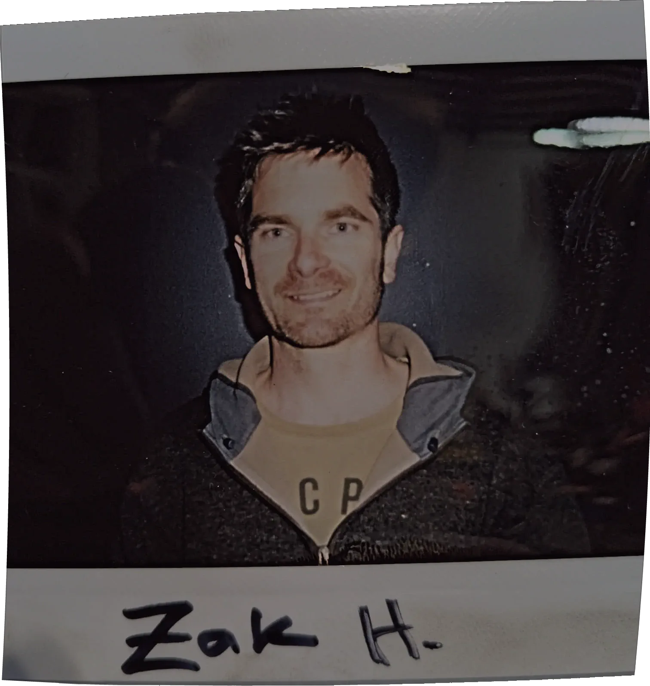

I came into software through geoscience, and I've stayed close to it. A geology degree first, then most of a decade building the platforms geologists actually work in – close enough to the technical detail to be useful, far enough up to shape what got built. The job titles along the way were product ones. The work itself was systems design: taking competing demands and turning them into something a team could execute.

The evidence is in what got built. Early on, a push to bring automated testing into the release process, to make it faster and more reliable. Later, a feature-priority framework that pulled competing business-unit demands into a single list the Leapfrog development team could work from. A customer feedback loop I owned and evolved across most of the decade. A process for putting working prototypes in front of users before release, so feedback landed while the features were still cheap to change. None of these was a deliverable on a job description – each happened because the gap was there and the work needed it. The same instinct now runs the [AI-assisted workflow](projects/ai-workflow.qmd) behind my coursework: competing parts reconciled into something executable, in a new medium.

The geoscience didn't stay in the past. The degree was geology and zoology – an exchange at the University of Iceland is most of the reason the geology stuck – and the product work itself was deep in the domain, building tools for structural geology, vein modelling, and 3D interpretation. Later came contract geomodelling work with Rogue Geoscience, including a PostgreSQL and Leapfrog drillhole workflow for Ivanhoe Electric's Santa Cruz copper project in Arizona, [written up as a project here.](projects/leapfrog-postgresql.qmd) Drillhole data, structural interpretation, the shape of a deposit underground: that domain knowledge sits underneath the remote-sensing work now rather than beside it. It's why I read a SAR scene or a change-detection result as a geoscientist would, not just as a technician running a pipeline.

The Master's in Geospatial Data Science is the deliberate part. Fifteen years of domain knowledge is worth more paired with the technical depth to act on it directly – remote sensing, geostatistics, spatial Python – instead of depending on someone else’s technical depth.

{.polaroid fig-alt="A polaroid of me pinned to the wall at RAD Bikes, my name handwritten in marker on the white border." fig-align="center" style="max-width:250px;"}