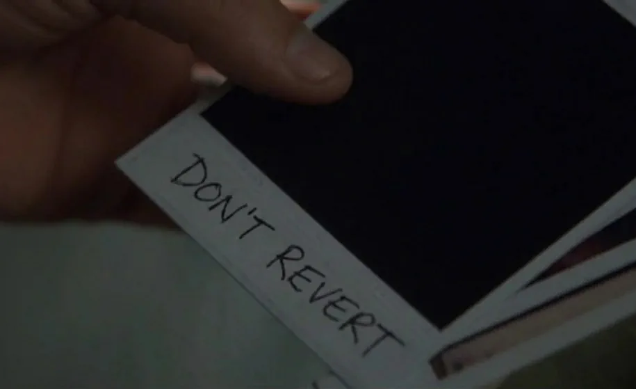

## Context

In [*Memento*](https://en.wikipedia.org/wiki/Memento_(film)), Leonard Shelby can't form new memories. His world resets every few minutes, so he moves his memory outside his head – notes, Polaroids, and for the things that must never be lost or revised, tattoos. The film is a thriller, but it's also a systems-design case study.

An LLM chat session has Leonard's condition. It starts cold every time, and it ends early more often than not – reliability drops well before the context window is full. Leave that unmanaged and the results are predictable. A decision made carefully in one session gets reopened, just as confidently, by the next. Work drifts. The reasoning behind a choice lives nowhere except a conversation that has already closed.

The last one is the real problem, and it's the same failure the
[Leapfrog + PostgreSQL page](leapfrog-postgresql.qmd) describes at a slower speed: a model becomes unmaintainable once the reasoning behind it leaves with the person who held it in their head. Here that happens in days rather than years. Every new session is the new geologist, handed the geometry and none of the answers.

I've built the fix before, in a different setting. For years I ran a priority system at a geoscience-software company – it reconciled competing demands on a single codebase, and one of its purposes was keeping state and reasoning legible to people who weren't in the room when a call got made. Managing AI sessions is that problem again in different clothes: a run of sessions with no memory between them, and decisions that have to outlive whoever – or whatever – made them. So the answer was never a better prompt. It's a small set of files, a few rituals, and a division of labour that keeps the final call with a person.

## The file system

Two files, split by lifecycle rather than topic. What goes where depends on how long it should live and how often it gets read, not what it's about. Leonard made the same split: Polaroids for what churns, tattoos for what must survive every reset untouched.

`PROJECT.md` churns. Current state, active work, the session log – rewritten constantly, kept under about 120 lines, pasted in at the start of every session. It answers the first question a cold session asks: where are things, and what's next? History doesn't collect here. That's what git is for.

`DECISIONS.md` persists. It's the drift-prevention record – the file that stops a decision made once, with full context, being quietly reopened by a later session without it. One rule keeps the pair stable: a stale-looking decision is not a wrong one. DECISIONS.md holds the decision, PROJECT.md holds current reality, and when today's state seems to contradict a settled choice, that's state to note – not a decision to reopen.

Each entry takes a fixed form:

```
[scope] [what]: [choice] — [reason]. Don't [specific drift].
```

The Don't clause goes in only when there's a real, nameable way a future session would steer wrong. One from the [Pepeha Mapped](pepeha-mapped.qmd) build:

```
[globe.py] projection: orthographic centred ~-43.5°S, 172.6°E.
LAEA abandoned (antimeridian artefacts). Don't revert.
```

That entry exists because the mistake happened at least once. A session that saw LAEA in an earlier discussion could plausibly steer back to it. The entry names the choice, the reason, and the wrong turn to refuse – so the next session doesn't re-derive anything, it just declines to undo the call.

::: {#fig-polaroid}
{fig-alt="A hand holding a Polaroid photograph, its image black and undeveloped, a handwritten note reading DON'T REVERT attached below." width="75%"}

Leonard's whole system, in one frame: the record lives outside the head because the head won't keep it. "Don't revert" is a real DECISIONS.md entry – the note names the wrong turn so the next session refuses it, rather than re-deriving the reason it was ruled out.
:::


## The rituals

The files only work if every session treats them the same way. At open: paste `PROJECT.md`, review state, ask about anything unclear, then start. The paste is the whole orientation – nothing recapped from memory, nothing reconstructed from a conversation that no longer exists. During: one task at a time, and anything that looks wrong gets flagged, not quietly fixed. A session that "corrects" something it half-understands is making work no one can see. At close: the log collapses into current state and backlog – unless the session ended degraded, in which case the collapse waits for the next open.

Log entries go in as the work happens, not at the end, because the end doesn't always arrive in usable shape. Each one is written to survive context loss – addressed to a session that wasn't in the room, readable on its own, not shorthand for a working memory that will be gone. It reads as paranoid right up until the session it saves.

## Division of labour

Most of the work is two parties: me, and a planning session. We design together – code architecture and document architecture both – argue the calls, and write the decisions down. That's the whole collaboration on most projects. The planning session is a capable colleague with one defect: it remembers nothing from yesterday – or worse, it *misremembers* things. So the files do the remembering a colleague otherwise would, and the ritual makes sure the next session reads them.

When a build is large enough, a third role appears. Pepeha Mapped was one – enough files and moving parts to warrant a dedicated executor, so Claude Code did the heavy edits. Most projects don't reach that bar; the executor is contingent on the work, not a fixed part of the workflow. When Code is in play it runs one task per prompt: reads the files, makes the edits, runs what it can, reports back, and stops. The one-task boundary isn't a throughput cap – it's the inspection point. Every task ends with a person looking at what happened before the next one starts.

Whether or not Code was involved, one thing doesn't move: nothing reaches the repository's public state without passing through my hands. Runtime testing happens in Jupyter, by me, because the executing session can't activate the environment – a limit that turned out to be a feature. The git commit and push are manual and mine. That's not ceremony. It's where "the AI did something" becomes "I've confirmed what it did."

Being concrete about what that caught, on the Pepeha build: a fetch function silently dropping data because of a hardcoded CRS in a bounding-box suffix; a projection that broke at the antimeridian; a layer handing back geographic coordinates where everything downstream expected NZTM. Some I caught, some the session caught, most fell to both of us reading the same evidence. The point isn't a scoreboard. It's that a person sat in front of every intermediate result, so wrong output got flagged instead of compounding.

Where code worked but couldn't be explained cleanly, it got rewritten anyway. The bar wasn't "it runs." It was code I could interrogate and defend – tested end to end, bugs caught, design calls mine. Generating code doesn't lower that bar. It raises the premium on the person holding it.

## The system correcting itself

A workflow that has never been wrong hasn't been used. This one has three corrections worth showing.

`DECISIONS.md` started append-only – never delete, never modify, the obvious guard against drift. Then it grew, superseded entries sat next to the entries that replaced them, and cold sessions began anchoring on the wrong version. The file built to prevent confusion had become a source of it. The rule changed: rewrite in place when a decision is genuinely superseded, because git holds the history – the file feeds session context, it isn't the audit trail. The template now records that old failure in its own header, so no future session re-suggests append-only for the reason I first chose it.

Two sessions disagreed about when to collapse the log. One argued for close of session, context still in hand; the next argued, just as confidently, for the open of the following one. Both are defensible, which is exactly why the sessions couldn't settle it. I took the arguments and made the call: collapse at close, defer to the next open when a session ends degraded. The dispute is the division of labour in miniature – the sessions argue, the arguments can be good on both sides, and someone who isn't a session has to break the tie.

Early on, sessions would reach for file tools – writing to disk, searching documents – when the output was a dozen lines that could go straight into the chat. One attempt spent an entire session's token budget trying to write to disk, and cost four hours before work could continue. The fix is a standing rule: all output as text in chat, pasted by hand. It looks like a small preference. It's three constraints at once – token economy, session reliability, and keeping me in the paste-and-commit loop.

None of these came from the system noticing its own failure. Each came from a person seeing the failure, working out the cause, and writing the fix back into the files. That's the honest shape of the arrangement: the system doesn't self-correct. It makes correction cheap, legible, and durable once a person supplies it.

## Reflection

The overhead is real, and it gets paid every session. Logging as you go interrupts the work it records. The open ritual spends the first few minutes re-orienting instead of producing. The verification never lets up – every intermediate result read, every piece of generated code held to a bar I could defend without the tool in the room. I'd make the trade again. The alternative isn't a lighter workflow; it's re-explaining the project to a goldfish each morning and hoping nothing settled comes unsettled.

The system doesn't prevent degradation – sessions still go bad, sometimes with context to spare. What it does is make degradation survivable: the state lives in the files, not the conversation, so a bad session gets abandoned and a fresh one rebuilt from the documents in minutes. That's a smaller promise than "reliable AI." It's one that holds.

For the record, this page was produced under the workflow it describes. The session that worked on it opened by reading the files it explains, logged as it went, and collapsed that log at close. The judgement calls – what to keep, what to cut, what the page is actually claiming – were mine, which is the whole point of the arrangement.