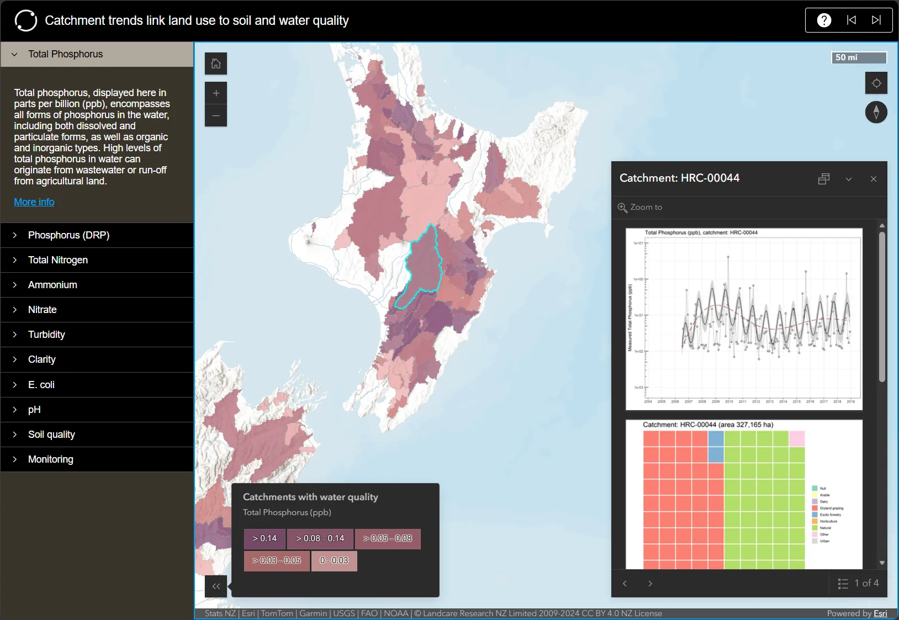

Manaaki Whenua – Landcare Research (since folded into the Bioeconomy Science Institute) held a contract to build an "interactive map" for Our Land and Water, a National Science Challenge project linking land-use change to soil and water quality across a set of New Zealand catchments. What the map was for, and who it was for, weren't in the contract – so that's where the work started.

Working that through with the researchers, the case that held up was public outreach, not a land-management tool: the deliverable's job was putting the findings in front of people who don't read dense scientific publications.

The platform call was ArcGIS Online, made on maintenance grounds. The team had accumulated enough bespoke web apps to know what each one costs after launch – security patches, web standards drift, a maintainer who's moved on – and AGOL leaves that burden with Esri. Part of the proposal work was prototyping the options directly in AGOL, so the researchers were choosing between working demonstrations rather than mock-ups.

The published result has two layers. A storymap carries the narrative — written by a Manaaki Whenua comms writer, with my input on shape rather than words: the interactive work sits embedded inside the story, not linked off to the side. Inside it is the webapp I built – an ArcGIS Online portfolio app tying the project's apps into one interface: one per monitored water-quality property – nitrogen and phosphorus species, turbidity, clarity, E. coli, pH – soil-quality apps per region, and a national map of the water-quality monitoring sites with soil-sampling locations shown as a heatmap, coarse enough to preserve landowner privacy. Time-series and waffle charts appear when you click into a catchment.

::: {.column-body-outset}
```{=html}
<div class="webapp-embed">
  <a id="ca-fallback" href="https://landcareresearch.maps.arcgis.com/apps/instant/portfolio/index.html?appid=7f28e9f244b140aebe362e48585acb84" target="_blank" rel="noopener">
    
    <p style="font-size:0.8rem; color:var(--bs-secondary-color, #aaa); margin-top:0.3rem;">Screenshot of the live app – click to open it directly.</p>
  </a>
  <script>
  (function () {
    var appid = "7f28e9f244b140aebe362e48585acb84";
    var appUrl = "https://landcareresearch.maps.arcgis.com/apps/instant/portfolio/index.html?appid=" + appid;
    var itemUrl = "https://landcareresearch.maps.arcgis.com/sharing/rest/content/items/" + appid + "?f=json";
    fetch(itemUrl)
      .then(function (r) { return r.json(); })
      .then(function (d) {
        if (d && !d.error) {
          var f = document.createElement("iframe");
          f.src = appUrl;
          f.width = "100%";
          f.height = "620";
          f.style.border = "0";
          f.loading = "lazy";
          f.title = "Catchment trends link land use to soil and water quality — ArcGIS Online";
          document.getElementById("ca-fallback").replaceWith(f);
        }
      })
      .catch(function () { /* item check failed — screenshot stays */ });
  })();
  </script>
</div>
```
:::

The embed can be sluggish — it runs best in its [native fullscreen form](https://landcareresearch.maps.arcgis.com/apps/instant/portfolio/index.html?appid=7f28e9f244b140aebe362e48585acb84). The full deliverable is the storymap itself: [Catchment trends link land use to soil and water quality](https://storymaps.arcgis.com/stories/30d6312e64c94c0b9567f439a0cac45b).

None of the science is mine. The research and data belong to the project team, and one of the developers curated the catchment records so the charts resolve on click. My part was the requirements work that settled what to build, the webapp itself, holding the output to the Manaaki Whenua style guide, and the less visible job of getting AGOL permissions right so collaborators from other agencies could edit the drafts — neither ArcGIS Online nor institutional IT gives that up easily.

I came on in September 2022 for a project due that December. It published in May 2024. The dependencies ran long — interagency projects do — and I stayed on a few hours a month across the tail to keep it moving and get it over the line. Not the glamorous end of delivery, but the end that decides whether a thing ships.