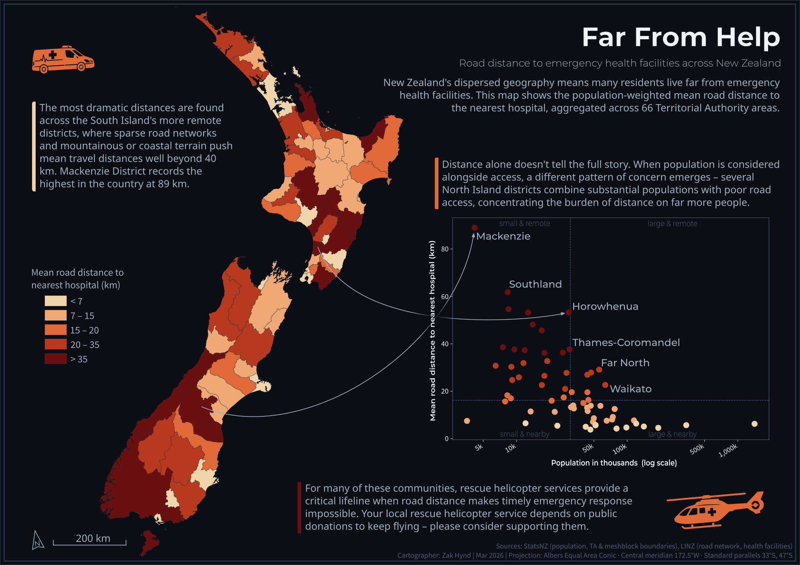
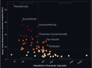

This started in a spatial analysis course (GISC404). A lab had us testing deprivation for spatial autocorrelation – Moran's I, LISA – and asked what other factors might be worth looking at alongside it. I calculated the euclidean distance to the nearest hospital: quickly done, but it ignores the roads people actually drive. When the geovisual analytics course (GISC403) set an open cartography brief, I took the chance to build the road-network version properly.

The brief was a mock **Atlas of Design** submission: a classed choropleth making a convincing argument from an explicit point of view. So the map needed a story, not just a variable.

::: {#fig-choropleth .column-body-outset}
{fig-alt="Dark-themed A3 poster titled Far From Help. A choropleth map of New Zealand colours each territorial authority from cream (under 7 km) to deep red (over 35 km) by mean road distance to the nearest hospital; remote South Island districts are darkest, with Mackenzie District called out at 89 km, the highest in the country. A scatterplot of population against distance highlights Horowhenua, Thames-Coromandel, Far North and Waikato as populous districts with poor road access. Closing text notes rescue helicopter services and asks readers to consider donating."}

The submitted A3 poster.
:::

The choropleth reads the way you'd expect: the longest mean distances sit in the remote South Island, where sparse roads and mountain terrain push them past 40 km, with Mackenzie District highest in the country at 89 km. But those districts are also the emptiest. Weight the same distances by population and a different set of places surfaces – Horowhenua, Thames-Coromandel, the Far North – districts where tens of thousands of people live a long drive from a hospital. The choropleth colours them mid-range and moves on; the scatterplot is on the poster to catch them.

::: {#fig-scatterplot .figure}
{fig-alt="Scatterplot of territorial authority population on a log scale against mean road distance to the nearest hospital. Mackenzie sits alone at top left, extreme distance and small population. Horowhenua, Thames-Coromandel, Far North and Waikato combine substantial populations with 25 to 55 km mean distances."}

Population against mean road distance to the nearest hospital, coloured by the map's distance classes. The populous-and-remote quadrant is the argument the choropleth can't make on its own.
:::

An earlier design was a bivariate choropleth, deprivation against access, closing the loop back to the lab that prompted the whole thing. It didn't look good, and the story got much harder to tell. One variable on the map and one on the scatterplot keeps both legible.

The distance layer is a network analysis in ArcGIS Pro: the LINZ road network, Health NZ public hospitals as destinations, and sample points along the roads roughly every kilometre. Each meshblock takes the mean of its sample points, weighted by its 2013 census population, and the weighted values aggregate up to territorial authority level.

The network took several rounds to build. The first attempts had roads that looked connected and weren't – the giveaway was travel distance jumping by tens of kilometres between neighbouring points inside a town. Snapping road endpoints together to within a couple of metres healed most of the breaks, and a few more passes caught the rest.

Verification was sanity-level. On a perceptually uniform colour ramp the network distances closely track the euclidean ones, diverging where they should – Banks Peninsula sits a short straight line from Christchurch and tens of kilometres of winding road from its hospital. Mackenzie's 89 km looked low against the 110 km drive from Tekapo to Timaru Hospital, but Fairlie holds a good share of the district's population and sits far closer. The figures compare districts; they aren't route planning. The population data is the other limit – 2013 meshblocks, over a decade stale, so the pattern holds better than the exact numbers.

The brief required an explicit point of view, and the poster's is the closing panel: for the districts the scatterplot points at, rescue helicopters cover the distance roads can't, and most of them fly on donations.