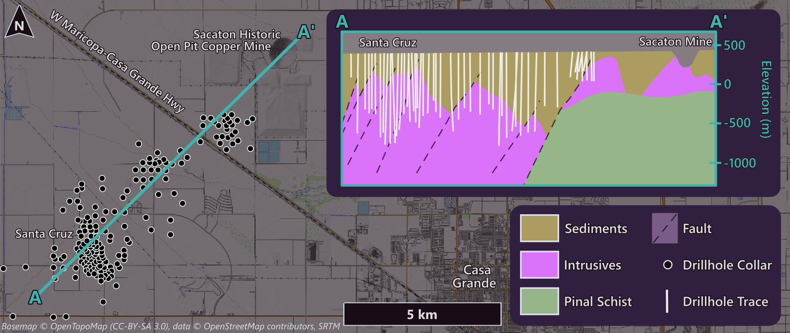
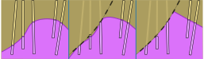

::: {#fig-overview .column-body-outset}
{fig-alt="A geological map and cross‑section of the Santa Cruz project area, with several hundred black drillhole collars clustered along a northeast-trending section line running from A in the southwest to A′ at the Sacaton historic open pit; 5 km scale bar. An inset geological cross‑section between the same A and A′ endpoints, elevation scale from 500 m to −1000 m. Tan sediments overlie purple intrusive igneous rocks, both cut by southwest-dipping dashed faults; green Pinal Schist basement rises toward the northeast beneath the Sacaton pit. White drillhole traces show drilling concentrated in the southwest half of the section."}

Overview map and drilling cross-section of the project. Section geology simplified from [Ivanhoe Electric's 2025 technical report, Fig. 6-2](https://www.sec.gov/Archives/edgar/data/1879016/000110465925061364/tm2518281d1_ex96-1.htm); layout and drillhole pattern after an [earlier figure from their website](https://web.archive.org/web/20260710030747/https://ivanhoeelectric.com/site/assets/files/8781/picture4-1.png) (c. 2022; drillhole locations approximate).
:::


## Context

This is Santa Cruz, a porphyry copper system a few kilometres outside Casa Grande, Arizona, modelled for Ivanhoe Electric in Leapfrog. I didn't build the original geologic model – I was brought in to keep it updated as the drilling campaign ramped up, daily revisions against incoming holes. By then multiple geologists had worked it over a few years, and it had reached the state long-running models reach: increasingly hard to maintain: early decisions needed overriding and the way it had been built made that overriding task expensive. The following work shown is reproduced with synthetic data – the structure and the reasoning are real, the numbers are not.

Leapfrog also had no way to record why a decision had been made – which is fine while the model lives in one geologist's head, but problematic when the model is shared among multiple users. Then the unwritten reasoning becomes the bottleneck. *"Why were those polyline edits added there – are they still needed, can I delete them? Why was that interval reclassified, who did it, when?"* The model held the geometry but not the answers.

So the work split across two fronts. One was the model itself – splitting it into independent components, so a problem in one stayed in one, and the client's regular requests for new features stopped meaning hand-repair across the whole model. The other was the database beneath the tool, where the multi-table logic and the provenance lived. That database wasn't built from scratch: the project ran on Rogue Geoscience's PostgreSQL schema, already in use across other jobs, and the work here was extending it to do what this model needed.

Both fronts push the same way. Leapfrog is built to run dynamically – new logging flows through to the models, and the geologist's hand shows up only where interpretation is needed: a reclassified interval, a polyline edit guiding where a contact surface should go. The aim was to lean on that as hard as possible – automate more, make the remaining manual edits faster to implement – and record who made each one, when, and why, so the next geologist (including a later you) has enough context to keep the decision or reject it against new information.


## Modelling architecture

The trigger was a change request, and not a small one. The client wanted to add more faults, widen the model to take in a new area, bring in new units, and revise the sequencing relationship between the faults and the sediments. Any one of those is routine. Together, on the existing build, they weren't.

The old model couldn't absorb the change cheaply. It was a single model where the faults crosscut everything, so each new fault raised the maintenance cost of every surface it touched – and revising the fault-sediment sequencing meant reworking relationships that were threaded through the whole thing. The model needed more than just another fault patched in – it needed rebuilding.

The rebuild was a separation of concerns. Rather than one model holding everything, the geology split into federated models – one for the faults, one for the **bedrock interface** (**BRI**), one for the bedrock units, a standalone model for the basalt dikes, and several valley-fill models, each isolating a problem the others didn't have to know about. The point wasn't tidiness – each model could now be regenerated on its own, without dragging the rest through a costly rebuild that it didn't need.

The BRI shows it best. It had been unioned from all the bedrock-unit volumes, which meant its geometry depended on checking and dissolving millions of coincident triangle faces – and about half the time it failed, throwing triangulation errors that required rerunning the whole regeneration after nudging the resolution a millimetre, then flipping a coin.

> Rebuilt as its own model, the contiguous BRI surface reprocessed in about a minute instead of roughly an hour.

The geometry it produces is a union of the fault-block volumes minus their eroded tops, which produces one contiguous surface that carries the fault scarps along with it (steps 2–3 of @fig-cross-section show the surface). Downstream operations – eg. geotech, resource modelling – needed that surface whole, fault-scarps included, so the contiguity wasn't cosmetic.

Three instruments controlled these surfaces: two database tables, and polyline edits in Leapfrog itself. The surfaces build the normal Leapfrog way – interpolated from interval data – but through SQL filters: legacy holes screened out, and each surface pulling its own points from `model_points` ('Bedrock Interface', 'Fault_03'). The interval table is the routine instrument – fine for modern drilling, where the logged contacts can be trusted to sit where the data says. It's the historic drilling that needs more careful handling: older holes with less reliable surveying and litho logs that were never recoded into the newer interpretation. For those, the bedrock intercept depths went in by hand as `model_points` rows – a downhole point marking the top of bedrock, easy to switch off or reclassify later without touching the raw tables.

The fault contacts went into the same `model_points` table. A fault contact isn't logged directly the way a lithology boundary is – it's interpreted, from the geometry indicated by the surrounding drillhole rocktypes, and other variables like assays, RQD, and core imagery. Where a geologist judged a hole to intercept a fault, the contact went into `model_points` as a downhole point, including the legacy holes and the cases where a contact is missing and its absence is itself information.

The polyline edits are the third instrument, draw and stored in Leapfrog rather than the database. They were segmented by purpose, not dumped into one object – geophysics-derived elevations in one, consistent step-fault offsets in another, max/min constraints in a third, with comment-and-date discipline encouraged on each. It helps the next person read what an edit was for. The edits were shared objects, inherited by multiple surfaces rather than redrawn for each – so when the change request added five new faults, the twenty-odd newly created surfaces this generated picked up the correct edits automatically. The same instinct as everywhere else here – define the thing once, let it propagate, keep the manual state minimal. That segmentation is discipline, not an audit trail – nothing enforces it, and nothing records who drew a polyline or when. The instruments that live in the database don't have that problem, which is the next section.

The idealised cross‑section below shows why the deposit has to be broken into parts. Revealing the section step by step – faults, BRI, bedrock, dikes, valley fill – illustrates how much complexity a single model would be trying to hold. Faults are built first not because they're oldest – they aren't – but because in Leapfrog they define the blocks the older units have to be modelled within. Build order is a tool constraint, not a geological sequence.

::: {#fig-cross-section .fig-capped}
```{=html}
<div class="cs-slider-wrap" style="margin: 2rem 0;">
  <div style="position: relative;">
    
  </div>
  <div style="margin-top: 0.75rem;">
    <div id="cs-label" style="font-size: 0.85rem; color: var(--bs-secondary-color, #aaa); margin-bottom: 0.5rem;"></div>
    <input id="cs-range" type="range" min="0" max="8" step="1" value="3" aria-label="Cross-section step" />
    <p id="cs-caption" style="font-size: 0.8rem; color: var(--bs-secondary-color, #aaa); margin-top: 0.3rem; margin-bottom: 0;"></p>
  </div>
</div>
```

Idealised cross-section, not to scale. The section cuts across a series of Basin & Range normal-fault blocks: roughly north–south-trending faults that have dropped and tilted the crust into alternating ranges and basins across the southwestern US and northern Mexico. The bedrock units have been displaced along those faults; whether the valley-fill sediments are too was still open during the rebuild – the published interpretation now appears to offset the lower fill, dying out up-sequence. The split build made that cheap to absorb either way: faulting a sediment unit meant moving it between models, not reworking the section; the cross-section shows the modelled interpretation of that geometry, not a measured survey. Synthetic data; structure and reasoning are real.
:::

::: {.column-margin}

**Legend**
<div style="font-size: 0.78rem; line-height: 2; margin-top: 0.25rem;">
 <svg width="16" height="16" style="margin-right:6px; vertical-align:middle;">
  <rect x="0" y="0" width="16" height="16" fill="#dce3ec" stroke="#ddd" stroke-width="1"/>
  <line x1="2" y1="14" x2="14" y2="2"
        stroke="#180d16"
        stroke-width="3"
        stroke-dasharray="7 5"/>
</svg>Faults<br>
 <svg width="16" height="16" style="margin-right:6px; vertical-align:middle;">
  <rect x="0" y="0" width="16" height="16" fill="#dce3ec" stroke="#ddd" stroke-width="1"/>
  <line x1="0" y1="5" x2="16" y2="10"
        stroke="#9a35c4"
        stroke-width="3"/>
</svg>Bedrock Interface<br>
  <span style="display:inline-block; width:16px; height:16px; background:#ded2c2; border:1px solid #555; margin-right:6px; vertical-align:middle;"></span>Alluvium<br>
  <span style="display:inline-block; width:16px; height:16px; background:#967661; border:1px solid #555; margin-right:6px; vertical-align:middle;"></span>Gila Conglomerate<br>
  <span style="display:inline-block; width:16px; height:16px; background:#2ad4ff; border:1px solid #555; margin-right:6px; vertical-align:middle;"></span>Lake Sediments<br> 
  <span style="display:inline-block; width:16px; height:16px; background:#866053; border:1px solid #555; margin-right:6px; vertical-align:middle;"></span>Whitetail Conglomerate<br>
  <span style="display:inline-block; width:16px; height:16px; background:#ff9ee4; border:1px solid #555; margin-right:6px; vertical-align:middle;"></span>Bedrock Material<br>
  <span style="display:inline-block; width:16px; height:16px; background:#484848; border:1px solid #555; margin-right:6px; vertical-align:middle;"></span>Mafic Conglomerate<br>
  <span style="display:inline-block; width:16px; height:16px; background:#a93132; border:1px solid #555; margin-right:6px; vertical-align:middle;"></span>Basal Conglomerate<br>
  <span style="display:inline-block; width:16px; height:16px; background:#2a7fff; border:1px solid #555; margin-right:6px; vertical-align:middle;"></span>Basalt Dikes<br>
  <span style="display:inline-block; width:16px; height:16px; background:#faa403; border:1px solid #555; margin-right:6px; vertical-align:middle;"></span>Porphyry<br>
  <span style="display:inline-block; width:16px; height:16px; background:#037f05; border:1px solid #555; margin-right:6px; vertical-align:middle;"></span>Diabase Dikes<br>
  <span style="display:inline-block; width:16px; height:16px; background:#fdc1cb; border:1px solid #555; margin-right:6px; vertical-align:middle;"></span>Oracle Granite<br>
  <span style="display:inline-block; width:16px; height:16px; background:#96b589; border:1px solid #555; margin-right:6px; vertical-align:middle;"></span>Pinal Schist<br>
</div>
:::


## The database layer

For the most part, Leapfrog modelled the geometry well enough. The two things it couldn't do are the two a long project needs most: reason across several tables at once, and remember why a decision was made. It reads drillhole data, but it won't compute a derived classification from the overlap of three other tables, and it has no native place to record that an interval was reclassified, by whom, or on what grounds.

So the database performed what the tool couldn't. The drilling data sat in PostgreSQL, and a layer of derived VIEWs sat between the raw tables and Leapfrog. The keystone was `lf_lith`: one flat table, assembled on the fly, that Leapfrog could consume as a single lithology source while the work of combining several tables happened underneath it, in SQL, where it was legible and reproducible.

::: {.fig-fit}
```{dot}
//| label: fig-lf-schema
//| fig-cap: "Raw and interpretation tables derive into VIEWs; Leapfrog reads only the VIEWs. The arrows show the flow of data, coloured by source table. The ignore table fans across the schema, marking records for Leapfrog's SQL filters to drop."

digraph schema {
  bgcolor="transparent";
  rankdir=LR;
  ranksep=0.9;
  nodesep=0.15;
  fontname="Open Sans";
  node [shape=box, style="filled,rounded", fontname="Open Sans", fontsize=11,
        color="#413f80", fillcolor="#30203e", fontcolor="#c6ebd1",
        height=0.34, margin="0.14,0.04"];
  edge [penwidth=1.5, arrowsize=0.6];

  subgraph cluster_raw {
    label="raw tables"; labeljust="l"; fontcolor="#c6ebd1";
    color="#413f80"; style="rounded";
    collar; survey; lithology; structures;
  }
  subgraph cluster_interp {
    label="interpretation"; labeljust="l"; fontcolor="#c6ebd1";
    color="#413f80"; style="rounded";
    model_points; model_intervals; model_ignore; colour_lookup;
  }
  subgraph cluster_views {
    label="derived VIEWs"; labeljust="l"; fontcolor="#c6ebd1";
    color="#413f80"; style="rounded";
    lf_collar; lf_survey; lf_model_pt; lf_structure; lf_alpha_only;
    lf_lith [fillcolor="#413f80", color="#85d9b1", penwidth=2.2];
  }
  leapfrog [shape=hexagon, fillcolor="#357ba3", color="#357ba3", fontcolor="#180d16"];

  // 1:1 plumbing — muted
  edge [color="#6b6480"];
  collar     -> lf_collar;
  survey     -> lf_survey;
  structures -> lf_structure;
  structures -> lf_alpha_only;
  model_points -> lf_model_pt;

  // feeders into lf_lith — one colour per source
  lithology       -> lf_lith [color="#85d9b1"];
  model_points    -> lf_lith [color="#3eb4ad"];
  model_intervals -> lf_lith [color="#4a9fd4"];
  colour_lookup   -> lf_lith [color="#d9a85c"];

  // ignore — schema-wide, fans across views
  edge [color="#cc7a8f"];
  model_ignore -> lf_collar;
  model_ignore -> lf_survey;
  model_ignore -> lf_lith;
  model_ignore -> lf_structure;

  // views to Leapfrog — muted, alpha dashed
  edge [color="#6b6480"];
  lf_collar    -> leapfrog;
  lf_survey    -> leapfrog;
  lf_model_pt  -> leapfrog;
  lf_lith      -> leapfrog;
  lf_structure -> leapfrog;
  lf_alpha_only -> leapfrog [style=dashed];
}
```
:::


::: {.callout-note}
## What `lf_lith` computes

`lf_lith` is a VIEW, not a stored table – it recomputes every time Leapfrog reads it, so the source tables stay the single point of truth. Its derived columns do the work that would otherwise be manual or impossible for Leapfrog to do on its own:

- `group_lith` – a coarser reclassification of the logged codes into broader units, for modelling at group level.
- `*_interp` – a set of reclassified-lithology columns (`basalt_interp`, `diabase_interp`, `porphyry_interp`, and others), each set from `model_intervals` where a geologist can override the logged code for an interval – usually to separate distinct layers or dikes so each models cleanly – without touching the original log.
- `hexRGB` – the logged colours blended to a single hex value by the colour-blend function over `colour_lookup`, so logged colour can display in 3D – Leapfrog can't render the named colours directly.
- `fault` – an `above_` / `below_` code, set from where the interval falls against fault-contact points in `model_points`. This is what keeps fault-boundary contacts from contaminating the surfaces they sit on.
- `ignore` / `ignore_comment` – a flag and a reason, pulled from the ignore table, marking intervals to be ignored from the model and saying why.
:::

The `fault` column is the clearest case of the database doing what the tool couldn't. A drillhole crossing a fault logs a contact at the fault plane – but that contact belongs to the fault, not to the lithological surface the modeller is trying to constrain. Fed in naively, it drags the surface toward the fault and distorts it. The fix is a filter: each interval is coded `above_` or `below_` the relevant fault from its overlap with the fault-contact points recorded in `model_points`, and the surface is informed only by the points on the correct side. The contaminating intervals don't get deleted – they get classified, and excluded from the relevant modelled surfaces.

The `fault` column is the clearest case of the database doing what the tool couldn't. A drillhole crossing a fault logs a contact at the fault plane – but that contact belongs to the fault, not to the lithological surface the modeller is trying to constrain. Leapfrog has its own answer to this: data is assigned to the fault block that it sits within. Near the fault, that assignment turns unreliable – an interval hugging the fault can land in the wrong block, depending on the local triangles, and one leaked sediment interval is enough to pull the surface down along the fault, rounding the scarp and smearing sediment into a face that should be all bedrock (@fig-fault-intervals, middle). The fix is to make side-membership explicit rather than geometric: each interval is coded `above_` or `below_` the relevant fault from its overlap with the fault-contact points recorded in `model_points`, and the surface is informed only by the correct side. The contaminating intervals don't get deleted – they get classified, and excluded from the relevant modelled surfaces.

::: {.table-responsive}
::: {#tbl-fault-filter}
| holeid | depth | type | code | comment | ... |
|---|---|---|---|---|---|
| SC-123 | `431.6` | `fault` | `Fault-04` | from RQD logs | ... |
: The `model_points` table records the fault pick {#tbl-fault-pick}

| holeid | from | to | major_lith | `fault` | ... |
|---|---|---|---|---|---|
| SC-123 | 425.0 | `431.6` | OracleGranite | `above_Fault-04` | ... |
| SC-123 | `431.6` | 445.0 | OracleGranite | `below_Fault-04` | ... |
: `lf_lith` reads the fault depth and codes the intervals on either side of it {#tbl-lf-lith-fault}

Fault-contact filter – rows in, derived column out
:::
:::


When Leapfrog models a surface from this table – bedrock below sediments, say – a single clause does the filtering: `WHERE fault NOT LIKE 'above_%'` drops everything coded above the fault, keeping the intervals below it and those no fault touches. Whole intervals, not just the pick, because intervals do interpolation work of their own: each typically carries volume points – distance values that push or pull the surface – so a sediment interval left in on the wrong side, regardless of the presence of a contact, can pull the surface down across the fault, and the scarp never forms (@fig-fault-intervals, middle).

::: {#fig-fault-intervals .fig-capped}
{fig-alt="Three panels showing the same cross-section with faulted intrusive igneous bedrock and overlying sedimentary units, illustrating how the surface interpolates differently depending on how the intervals are handled"}

The same drilling, three variants. Left: no fault – the bedrock surface interpolates as one mound. Middle: fault added, side-assignment left to the tool's volume filtering – leaked near-fault intervals round the scarp and bleed sediment across the fault. Right: intervals coded in the database (@tbl-fault-filter) and excluded outright – the surface meets the fault cleanly. Idealised; same conventions as @fig-cross-section.
:::


The `ignore` column works the same way. An interval flagged in `model_ignore` – bad recovery, suspect logging, a historic hole with questionable survey data – gets an ignore code and an ignore_comment saying why. In Leapfrog, `AND ignore IS NULL` drops it. One filtering idiom, applied to two different problems: don't delete the questionable data, code it, and let a `WHERE` clause decide what the model sees. The raw log stays intact and the reason stays attached.

The interpretation tables hold their own provenance. Every row records who made the edit, when, why, and how confident they were – and rows are deactivated rather than deleted, so another geologist's interpretation can be switched off, tested against, or restored without destroying it. Leapfrog offers nothing comparable: an edit made inside a Leapfrog project is overwritten the next time the drilling reloads, and nothing records who made it or what it said. This is the answer to the questions the old model couldn't hold – *why was that interval reclassified, who did it, when* – answered in the table itself.


<style>
/* #tbl-audit: keep cells on one line except the 'comment' column */
#tbl-audit td:nth-child(7),
#tbl-audit th:nth-child(7) {
  white-space: normal;
  min-width: 14rem;
}
</style>
::: {.column-body-outset .table-responsive}
::: {#tbl-audit}
| holeid | from | to | type | code | confidence | comment | active | updated_by | updated_at |
|---|---|---|---|---|---|---|---|---|---|
| SC-84 | 452.0 | 458.5 | diabase | dike-25 | 4 | re-examined core imagery | FALSE | j-smith | 2022-03-14 |
| SC-123 | 514.2 | 517.1 | colluvium | float | 1 | granite with sediment intervals below | TRUE | z-hynd | 2023-10-01 |
| SC-144 | 627.4 | 628.5 | basalt | dike-03 | 2 | assuming ~170/90 orientation | TRUE | z-hynd | 2023-09-26 |

Rows from `model_intervals` – every interpretation records its author, its date, its reasoning, and a confidence grade. Deactivated rows stay in the table.
:::
:::


## Easier to interpret, not just maintain

Two additional features that weren't asked for, but I implemented because I thought they would be useful. Both started as questions – could the database make the model easier to interpret, not just easier to maintain.

**Colour blend**

Core is logged with named colours, not hex – "Dark Brown", "Light Grey", and so on, up to six per interval across `major`, `minor`, and `streak`. Leapfrog can't render a named colour, so by default the logged colour never makes it into 3D, and a geologist scanning the model loses one of the cues they'd use at the core tray.

So the database delivered a solution. A lookup table, `colour_lookup`, paired every colour name that appears in the lithology log with a suitable hex value. The blend function then took the up-to-six colours on an interval and combined them into a single hexRGB (eg, <span style="display:inline-block; width:0.9em; height:0.8em; border:1px solid #888;background-color:#3EB4AD;"></span>`#3EB4AD` – oh hey [chrysocolla!](https://web.archive.org/web/20260310163606/https://ivanhoeelectric.com/site/assets/files/10945/scc_084_746-749m-1-1_1.800x0.jpg){.lightbox description="Chrysocolla in SCC-084 core, 746–749 m"}), weighted so the `major` colours dominate and the `streak` only tints. The interval then renders in 3D as close as a single value can get – near-identical to the average colour visible in the core photos.


::: {#fig-rgb-intervals .fig-capped}
{fig-alt="Schematic 3D plot of drillhole intervals displaying logged rock colour"}

Schematic 3D plot of drillhole intervals displaying blended logged rock colour (hexRGB). Synthetic data.
:::


**Alpha-only structure**

Oriented core gives two angles: alpha, the dip of a plane relative to the core axis, and beta, its rotation around that axis. Alpha alone fixes a cone the plane could lie on; beta is what pins it to a single orientation. A lot of structural logging, especially older logging, records alpha and no beta – which leaves the measurement real but unplottable. Leapfrog needs both, so these data just throw table errors.

::: {.column-margin}
Beta is measured from a fixed reference on the core – usually a line marked along the bottom of the hole. No reference line, no beta.
:::

With alpha but no beta, the true plane sits somewhere on a cone of possible orientations – so rather than discard the measurement, the `lf_alpha_only` VIEW reconstructs the cone. It fans roughly ten synthetic beta values around the circle for each alpha-only measurement, each offset about a millimetre in depth to dodge the duplicate-point flag Leapfrog raises on coincident points. In 3D the fan appears like an hourglass – view-only, never a direct input to a surface – and set beside the properly oriented structures and the modelled contacts nearby, it lets a geologist judge by eye whether a surface's orientation is validated by the structural measurements.

The @fig-alpha-only below shows the idea in section: two drillholes cutting a set of bedding structures logged with alpha but no beta, each hourglass the same cone construction sliced flat.

::: {#fig-alpha-only .fig-capped}
{fig-alt="Cross-section showing two drillholes intersecting four bedding structures, each drawn as an hourglass of possible plane orientations"}

Idealised cross-section through two drillholes (grey) and the modelled sedimentary units. Four bedding structures logged with alpha but no beta. For each, the white line shows the steepest apparent dip that the structure can present in this section, and the transparent fill marks the full range of apparent dips generated as the plane sweeps through the possible beta angles. Synthetic data; the geometry is schematic, not surveyed.
:::

## Reflection

The two halves of this don't quite sit equally.

The model split was the right call. A build that couldn't absorb a change request got rebuilt into separate models that could each be regenerated on their own – the failing BRI went from a roughly hour-long regeneration (that had to be restarted half the time), to about a minute, by isolating the concern that was breaking. That's a clean win. Faced with the same problem again, the same decision.

The database layer is one I'm slightly conflicted about. It solved the problems that mattered – the multi-table logic Leapfrog couldn't do, the provenance it couldn't keep – and solved them well. But it solved them by extending the schema underneath the tool, and an extended schema is still a thing the next person has to learn. The work here – the fault-contact filter, the `model_ignore` table, the `model_intervals` reclassification, the colour-blend function, the alpha-only VIEW – was built onto Rogue Geoscience's PostgreSQL schema, not invented from scratch, and that cuts both ways. The standard conventions give anyone who's worked a Rogue database a head start; the bespoke parts – the alpha-only cone reconstruction among them – are the ones with no precedent to lean on. Better than the unmaintainable single model it replaced, but not free.

I'd still build it. The provenance problem was real and compounding, and on a multi-year, multi-geologist project the cost of not solving it lands on exactly the people least equipped to absorb it – whoever picks the model up after the person who held it in their head has gone. But the trade-off is real and I'd rather name it than dress it up: I traded a tool anyone can open for a system someone has to learn. On this project that was the right trade. It isn't always.