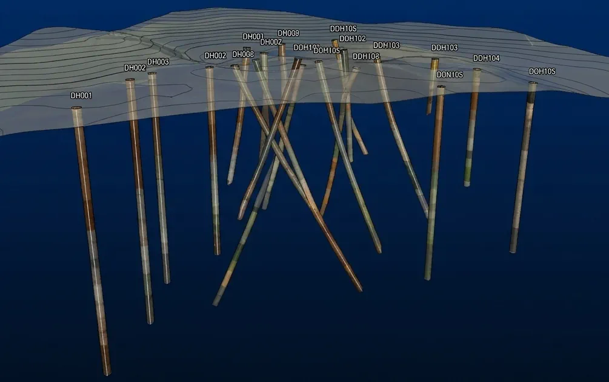
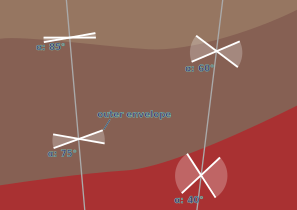

---
title: "Leapfrog + PostgreSQL drilling workflow"
subtitle: "[Rebuilding a stalled geologic model, and the database layer beneath the tool]"
format:
  html:
    toc: true
    css: assets/leapfrog-postgresql/cross-section-slider.css
    include-after-body: assets/leapfrog-postgresql/cross-section-slider.js
---

## Context

This is a porphyry copper system near Santa Cruz, Arizona, modelled for Ivanhoe Electric in Leapfrog. I didn't build the original – I was brought in to keep it updated as the drilling campaign ramped up, daily revisions against incoming holes. The model had been going for years by then, and it had reached the state long-running models reach: increasingly hard to maintain, because the early decisions needed overriding and the way it had been built made overriding them expensive. The work shown here is reproduced with synthetic data – the structure and the reasoning are real, the numbers are not.
The real setup was a long-running interpretation project: several geologists, several years, on a commercial modelling tool with known structural limits. Two of those limits drove everything that follows. The tool couldn't, on its own, rebuild a model that had grown too tangled to patch. And it couldn't record why a decision had been made – which doesn't matter much when the model lives in one person's head, and starts mattering a great deal when it doesn't. Once several geologists work the same model, the unwritten reasoning becomes the bottleneck. Why were those polyline edits added there – are they still needed, can I delete them? Why was that interval reclassified, who did it, when? The model held the geometry but not the answers.
So the work split across two fronts. One was the modelling architecture – how the geology was decomposed into models that could be rebuilt rather than hand-repaired. The other was the database beneath the tool, where the multi-table logic and the provenance lived. That database wasn't built from scratch: the project ran on Rogue Geoscience's PostgreSQL schema, already in use across other jobs, and the work here was extending it to do what this model needed. Different problems, one instinct underneath: compute and derive what you can, hand-maintain only what you must, and make the manual edits that remain deliberate and legible. What follows is a worked response to a tool's limits, not a feature tour.


## Modelling architecture

*The trigger was a change request, and not a small one. The client wanted to add more faults, widen the model to take in a new area, bring in new units, and revise the sequencing relationship between the faults and the sediments. Any one of those is routine. Together, on the existing build, they weren't.
The old model couldn't absorb the change cheaply. It was a single model where the faults crosscut everything, so each new fault raised the maintenance cost of every surface it touched – and revising the fault-sediment sequencing meant reworking relationships that were threaded through the whole thing. The model didn't need another fault patched in. It needed rebuilding.
The rebuild separated the modelling concerns. Rather than one model carrying everything, the geology split into federated models – one for the faults, one for the **bedrock interface** (**BRI**), one for the bedrock units, a standalone model for the basalt dikes, and several valley-fill models, each isolating a problem the others didn't have to know about. The point wasn't tidiness. It was that each model could now be regenerated on its own, without dragging the rest through a costly rebuild it didn't need.
The clearest case was the BRI. It had been unioned from all the bedrock-unit volumes, which meant its geometry depended on every unit resolving cleanly – and about half the time it didn't, throwing triangulation errors that required rerunning the whole regeneration with a minor millimetre resolution adjustment and a flip of a coin.

> Rebuilt as its own model, the reprocessing of the contiguous BRI surface dropped from roughly an hour to about a minute.

The geometry it produces is a union of the fault-block volumes minus their eroded tops, which produces one contiguous surface that carries the fault scarps along with it. Downstream operations – eg. geotech, resource modelling – needed that surface whole, fault-scarps included, so the contiguity wasn't cosmetic.
Three instruments controlled these surfaces, each picking up where the last ran out. The interval table is the routine one – fine for modern drilling, where the logged contacts can be trusted to sit where the data says. It's the historic drilling that needs more: older holes with less reliable surveying and litho logs that were never recoded into the newer interpretation. For those, the bedrock interface was logged by hand into the model_points table – a downhole point marking the top of bedrock where the interval data couldn't be relied on to find it.
The same model_points table carried the fault contacts. A fault contact isn't logged directly the way a lithology boundary is – it's interpreted, read off the surrounding data: RQD, assays, rocktypes, logged colours, core imagery. Where a geologist judged a fault to cross the hole, the contact went into model_points as a downhole point, including the legacy holes and the cases where a contact is missing and its absence is itself information.
Then the polylines – the instrument for where no drilling constrains the surface at all. Leapfrog polyline edits, used where the interpolation needs nudging toward the surrounding data and the geological pattern. Drilling tells you where the surface is; the polylines tell you where it should go where nothing drilled it.
Those polyline edits were segmented by purpose, not dumped into one object – geophysics-derived elevations in one, consistent step-fault offsets in another, max/min constraints in a third, with comment-and-date discipline encouraged on each. That's separation of concerns, and it helps the next person read what an edit was for.
It also did real work. The edits were shared objects, inherited by multiple modelled surfaces rather than redrawn for each – so when the change request added five new faults, the surfaces they generated picked up the right edits automatically, without anyone re-tracing them. Segmenting by purpose wasn't only tidiness; it was what made the edits reusable across surfaces that didn't exist yet. The same instinct as everywhere else here – define the thing once, let it propagate, keep the manual state minimal.
What it is not is an audit trail. The discipline is manual, and the real provenance record lives in the database, not here.
One move is worth pulling out, because it's the instinct in miniature. The dike swarms shared a common offset surface as reference geometry, rather than each dike being placed by hand. With perhaps fifty similarly-oriented dikes built against one reference, adjusting their orientation became a matter of moving the reference surface – the whole swarm followed. Dynamic control, minimal manual state, and a long interpretation job made considerably shorter.
The simplified idealised cross‑section below shows why the deposit has to be broken into parts. Revealing the section step by step – faults, BRI, bedrock, dikes, valley fill – illustrates how much complexity a single model would be trying to hold. Faults are built first not because they're oldest – they aren't – but because in Leapfrog they define the blocks the older units have to be modelled within. Build order is a tool constraint, not a geological sequence.

::: {#fig-cross-section}
```{=html}
<div class="cs-slider-wrap" style="margin: 2rem 0;">
  <div style="position: relative;">
    
  </div>
  <div style="margin-top: 0.75rem;">
    <div id="cs-label" style="font-size: 0.85rem; color: var(--bs-secondary-color, #aaa); margin-bottom: 0.5rem;"></div>
    <input id="cs-range" type="range" min="0" max="6" step="1" value="3" aria-label="Cross-section step" />
    <p id="cs-caption" style="font-size: 0.8rem; color: var(--bs-secondary-color, #aaa); margin-top: 0.3rem; margin-bottom: 0;"></p>
  </div>
</div>
```

Idealised cross-section, not to scale. The section cuts across a series of Basin & Range normal-fault blocks; roughly north–south-trending faults that have dropped and tilted the crust into alternating ranges and basins across the southwestern US and northern Mexico. The bedrock units have been displaced along those faults, and there is still debate about whether any of the valley fill sediments are also displaced; the cross-section shows the modelled interpretation of that geometry, not a measured survey. 'Synthetic data'; structure and reasoning are real.
:::

::: {.column-margin}

**Legend**
<div style="font-size: 0.78rem; line-height: 2; margin-top: 0.25rem;">
 <svg width="16" height="16" style="margin-right:6px; vertical-align:middle;"><rect x="0" y="0" width="16" height="16" fill="#888" stroke="#ddd" stroke-width="1"/><line x1="2" y1="14" x2="14" y2="2" stroke="#222" stroke-width="4"/></svg>Faults<br>
  <span style="display:inline-block; width:16px; height:16px; background:#ded2c2; border:1px solid #555; margin-right:6px; vertical-align:middle;"></span>Alluvium<br>
  <span style="display:inline-block; width:16px; height:16px; background:#967661; border:1px solid #555; margin-right:6px; vertical-align:middle;"></span>Gila Conglomerate<br>
  <span style="display:inline-block; width:16px; height:16px; background:#2ad4ff; border:1px solid #555; margin-right:6px; vertical-align:middle;"></span>Lake Sediments<br> 
  <span style="display:inline-block; width:16px; height:16px; background:#866053; border:1px solid #555; margin-right:6px; vertical-align:middle;"></span>Whitetail Conglomerate<br>
  <span style="display:inline-block; width:16px; height:16px; background:#ff9ee4; border:1px solid #555; margin-right:6px; vertical-align:middle;"></span>Bedrock Colluvium<br>
  <span style="display:inline-block; width:16px; height:16px; background:#484848; border:1px solid #555; margin-right:6px; vertical-align:middle;"></span>Mafic Conglomerate<br>
  <span style="display:inline-block; width:16px; height:16px; background:#a93132; border:1px solid #555; margin-right:6px; vertical-align:middle;"></span>Basal Conglomerate<br>
  <span style="display:inline-block; width:16px; height:16px; background:#2a7fff; border:1px solid #555; margin-right:6px; vertical-align:middle;"></span>Basalt Dikes<br>
  <span style="display:inline-block; width:16px; height:16px; background:#faa403; border:1px solid #555; margin-right:6px; vertical-align:middle;"></span>Porphyry<br>
  <span style="display:inline-block; width:16px; height:16px; background:#037f05; border:1px solid #555; margin-right:6px; vertical-align:middle;"></span>Diabase Dikes<br>
  <span style="display:inline-block; width:16px; height:16px; background:#fdc1cb; border:1px solid #555; margin-right:6px; vertical-align:middle;"></span>Oracle Granite<br>
</div>
:::


## The database layer

For the most part, Leapfrog modelled the geometry well-enough. What it couldn't do was the two things a long project needs most: reason across multiple tables at once, and remember why a decision was made. It reads drillhole data, but it won't compute a derived classification from the overlap of three other tables, and it has no native place to record that an interval was reclassified, by whom, or on what grounds. On a model that lives in one geologist's head for a few weeks, neither gap matters. On one worked by several people over several years, both compound – the reasoning that never got written down becomes the thing nobody can reconstruct.So the database carried what the tool couldn't. The drilling data sat in PostgreSQL, and a layer of derived VIEWs sat between the raw tables and Leapfrog. The keystone was `lf_lith`: one flat table, assembled on the fly, that Leapfrog could consume as a single lithology source while the work of combining several tables happened underneath it, in SQL, where it was legible and reproducible.

```{dot}
//| label: fig-lf-schema
//| fig-cap: "Raw and interpretation tables derive into VIEWs; Leapfrog reads only the VIEWs. The arrows show the flow of data, coloured by source table. The ignore table fans across the schema, marking records to be ignorable within Leapfrog's SQL filters."

digraph schema {
  bgcolor="transparent";
  rankdir=LR;
  ranksep=0.9;
  nodesep=0.15;
  fontname="Open Sans";
  node [shape=box, style="filled,rounded", fontname="Open Sans", fontsize=11,
        color="#413f80", fillcolor="#30203e", fontcolor="#c6ebd1",
        height=0.34, margin="0.14,0.04"];
  edge [penwidth=1.5, arrowsize=0.6];

  subgraph cluster_raw {
    label="raw tables"; labeljust="l"; fontcolor="#c6ebd1";
    color="#413f80"; style="rounded";
    collar; survey; lithology; structures;
  }
  subgraph cluster_interp {
    label="interpretation"; labeljust="l"; fontcolor="#c6ebd1";
    color="#413f80"; style="rounded";
    model_points; model_intervals; model_ignore; colour_lookup;
  }
  subgraph cluster_views {
    label="derived VIEWs"; labeljust="l"; fontcolor="#c6ebd1";
    color="#413f80"; style="rounded";
    lf_collar; lf_survey; lf_model_pt; lf_structure; lf_alpha_only;
    lf_lith [fillcolor="#413f80", color="#85d9b1", penwidth=2.2];
  }
  leapfrog [shape=hexagon, fillcolor="#357ba3", color="#357ba3", fontcolor="#180d16"];

  // 1:1 plumbing — muted
  edge [color="#6b6480"];
  collar     -> lf_collar;
  survey     -> lf_survey;
  structures -> lf_structure;
  structures -> lf_alpha_only;
  model_points -> lf_model_pt;

  // feeders into lf_lith — one colour per source
  lithology       -> lf_lith [color="#85d9b1"];
  model_points    -> lf_lith [color="#3eb4ad"];
  model_intervals -> lf_lith [color="#4a9fd4"];
  colour_lookup   -> lf_lith [color="#d9a85c"];

  // ignore — schema-wide, fans across views
  edge [color="#cc7a8f"];
  model_ignore -> lf_collar;
  model_ignore -> lf_survey;
  model_ignore -> lf_lith;
  model_ignore -> lf_structure;

  // views to Leapfrog — muted, alpha dashed
  edge [color="#6b6480"];
  lf_collar    -> leapfrog;
  lf_survey    -> leapfrog;
  lf_model_pt  -> leapfrog;
  lf_lith      -> leapfrog;
  lf_structure -> leapfrog;
  lf_alpha_only -> leapfrog [style=dashed];
}
```

::: {.callout-note}
## What `lf_lith` computes

`lf_lith` is a VIEW, not a stored table – it recomputes every time Leapfrog reads it, so the source tables stay the single point of truth. Its derived columns do the work that would otherwise be manual or impossible for Leapfrog to do on its own:

- `group_lith` – a coarser reclassification of the logged codes into broader units, for modelling at group level.
- `*_interp` – a set of reclassified-lithology columns (`basalt_interp`, `diabase_interp`, `porphyry_interp`, and others), each set from `model_intervals` where a geologist can override the logged code for an interval – usually to separate distinct layers or dikes so each models cleanly – without touching the original log.`
- `hexRGB` – the blended logged colours as a single hex value – before Imago core imagery could be pulled into 3D, this was the next best thing, computed by the colour-blend function over `colour_lookup`.
- `fault` – an `above_` / `below_` code, set from where the interval falls against fault-contact points in `model_points`. This is what keeps fault-boundary contacts from contaminating the surfaces they sit on.
- `ignore` / `ignore_comment` – a flag and a reason, pulled from the ignore table, marking intervals to be ignored from the model and saying why.
:::

The `fault` column is worth focusing on, because it's the clearest case of the database doing what the tool couldn't. A drillhole crossing a fault logs a contact at the fault plane – but that contact belongs to the fault, not to the lithological surface the modeller is trying to constrain. Fed in naively, it drags the surface toward the fault and distorts it. The fix is a filter: each interval is coded `above_` or `below_` the relevant fault from its overlap with the fault-contact points recorded in `model_points`, and the surface is informed only by the points on the correct side. The contaminating intervals don't get deleted – they get classified, and excluded from the relevant modelled surfaces.


::: {#tbl-fault-filter}
| holeid | depth | type | code | comment | ... |
|---|---|---|---|---|---|
| SC-123 | 431.6 | `fault` | `Fault-04` | from RQD logs | ... |
: The `model_points` table records the fault pick {#tbl-fault-pick}

| holeid | from | to | major_lith | `fault` | ... |
|---|---|---|---|---|---|
| SC-123 | 425.0 | 431.6 | OracleGranite | `above_Fault-04` | ... |
| SC-123 | 431.6 | 445.0 | OracleGranite | `below_Fault-04` | ... |
: `lf_lith` reads the fault depth and codes the intervals on either side of it {#tbl-lf-lith-fault}

Fault-contact filter – rows in, derived column out
:::


The same granite, logged continuously through the hole, split into two coded intervals by the fault pick sitting between them. When Leapfrog models a surface from this table, a single clause does the filtering: `WHERE fault IS NULL` drops both coded intervals, leaving only the intervals no fault runs through. The contaminating data isn't deleted – it's coded, and the code is what excludes it.

This matters more than dropping a single contact point, because the intervals do real interpolation work. Each one typically carries volume points – distance values that push or pull the interpolated surface c so an interval left in on the wrong side of a fault doesn't just add a stray contact, it drags the surface across the fault toward data that belongs to the other block. Coding the whole interval, not just the pick, is what keeps that from happening.

The `ignore` column works the same way, and that's the point of the pattern. An interval flagged in `model_ignore` – bad recovery, suspect logging, a historic hole with questionable survey data – gets an ignore code and an ignore_comment saying why. In Leapfrog, `AND 'ignore' IS NULL` drops it. One filtering idiom, applied to two different problems: don't delete the questionable data, code it, and let a `WHERE … IS NULL` clause decide what the model sees. The raw log stays intact and the reason stays attached.

## Easier to interpret, not just maintain

Two builds nobody asked for. Both started as questions – could the database make the model easier to interpret, not just easier to maintain – and both turned out useful enough to keep. They sit outside the original brief, which is why they're here rather than above.

**Colour blend**
Core is logged with named colours, not hex – "Dark Brown", "Light Grey", and so on, up to six per interval across major, minor, and streak. Leapfrog can't render a named colour, so by default the logged colour never makes it into 3D, and a geologist scanning the model loses one of the cues they'd use at the core tray.

So the database supplied it. A lookup table, colour_lookup, paired every colour name that appears in the lithology log with a suitable hex value. The blend function then took the up-to-six colours on an interval and combined them into a single hexRGB, weighted so the major colour dominates and the streak only tints – the same priority a geologist reads them in. The interval then renders in 3D as close to its logged colour as a single value allows.

::: {#fig-rgb-intervals}
{fig-alt="Schematic 3D plot of drillhole intervals displaying logged rock colour" width="75%"}

Schematic 3D plot of drillhole intervals displaying blended logged rock colour (hexRGB). Synthetic data.
:::

It's worth noting this was the workaround of its time. The direct path now is Imago – core photography linked into Leapfrog, so the actual core imagery shows in 3D rather than a blended approximation of it. The blend solved the problem with what was available; the problem it solved has since been solved better.

**Alpha-only structure**
Oriented core gives two angles: alpha, the dip of a plane relative to the core axis, and beta, its rotation around that axis. Alpha alone fixes a cone the plane could lie on; beta is what pins it to a single orientation. A lot of structural logging, especially older logging, records alpha and no beta – which leaves the measurement real but unplottable. Leapfrog needs both, so those intervals simply don't appear.

::: {.column-margin}
Beta is measured from a fixed reference on the core – usually a line marked along the bottom of the hole. No reference line, no beta.
:::

The cone is the insight. With alpha but no beta, the true plane sits somewhere on a cone of possible orientations – so rather than discard the measurement, the `lf_alpha_only` VIEW reconstructs the cone. It fans roughly ten synthetic beta values around the full circle for each alpha-only measurement, each offset about a millimetre in depth to dodge the duplicate-point flag Leapfrog raises on coincident data. In 3D the fan stands as an hourglass – view-only, never feeding a surface – and set beside the properly oriented structures and the modelled contacts nearby, it lets a geologist judge by eye whether a surface's orientation is validated by the structural measurements.

The figure below shows the idea in section. Two drillholes cut a set of bedding structures logged with alpha but no beta; each hourglass is the same construction sliced flat, the white lines marking the envelope where the plane lies in the section plane and the fill spanning the orientations the unknown beta could take.

::: {#fig-alpha-only}
{fig-alt="Cross-section showing two drillholes intersecting four bedding structures, each drawn as an hourglass of possible plane orientations" width="75%"}

Idealised cross-section through two drillholes (grey) and the modelled sedimentary units. Four bedding structures logged with alpha but no beta. For each, the white lines mark the outer envelope of apparent intersection – the two beta values where the bedding plane lies normal to the section plane – and the transparent fill spans the full range of orientations the unknown beta could take. Synthetic data; the geometry is schematic, not surveyed.
:::

## Reflection

The two halves of this don't sit the same way, and it's worth being plain about why.

The model split was the right call without qualification. A build that couldn't absorb a change request got rebuilt into separate models that could each be regenerated on their own – the failing BRI went from a roughly hour-long regeneration (that had to be restarted half the time), to about a minute, by isolating the concern that was breaking. That's a clean win. Faced with the same problem again, the same decision.

The database layer is where the honest tension sits. It solved real problems – the multi-table logic Leapfrog couldn't do, the provenance it couldn't keep – and it solved them well. But it solved them by extending the schema underneath the tool, and an extended schema is still a thing the next person has to learn. The work here – the fault-contact filter, the `model_ignore` table, the `model_intervals` reclassification, the colour-blend function, the alpha-only VIEW – was built onto Rogue Geoscience's PostgreSQL schema, not invented from scratch. That cuts both ways. It means the conventions are partly standard, so anyone who's worked a Rogue database has a head start. It also means the bespoke parts – the genuinely new ideas, the alpha-only cone reconstruction among them – are the parts with no precedent to lean on. Better than the unmaintainable single model it replaced, but better isn't free. Someone inherits it.

I'd still build it. The provenance problem was real and compounding, and on a multi-year, multi-geologist project the cost of not solving it lands on exactly the people least equipped to absorb it – whoever picks the model up after the person who held it in their head has gone. But the trade-off is real and I'd rather name it than dress it up: I traded a tool anyone can open for a system someone has to learn. On this project that was the right trade. It isn't always.