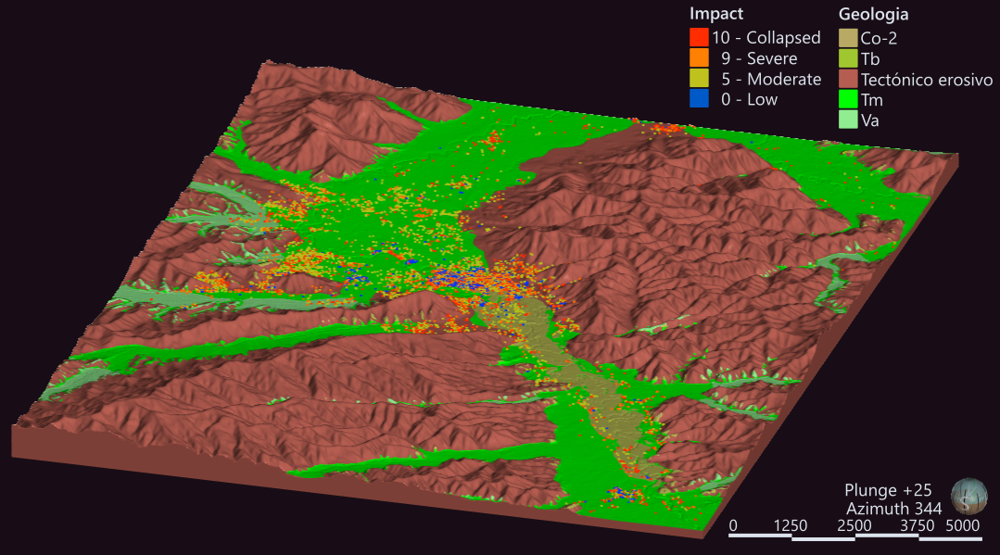
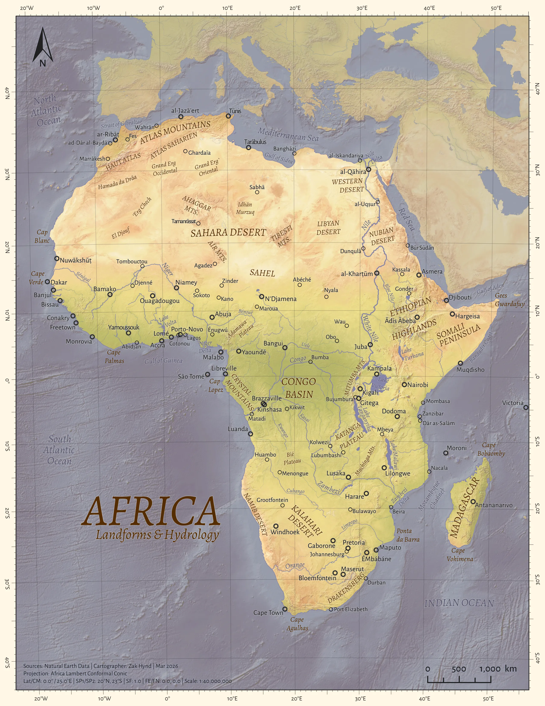
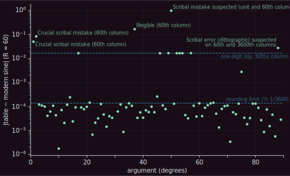

Smaller pieces, each here because it shows something specific: geomodelling applied to earthquake hazard, cartographic design under pressure, and an analytical instinct that travels outside geospatial work entirely.

## Portoviejo earthquake damage – 3D geological model

After the Mw 7.8 Jama-Pedernales earthquake in 2016, building damage in Portoviejo, Ecuador clustered in patterns shaking intensity alone didn't explain. I built the 3D geological model of the city in Leapfrog; the model connected each building to the rock type beneath it, providing the geological context needed to interpret the damage patterns.

Modelling from a geological map usually means digitising contact polylines, which tell a contact surface where it should pass but nothing about where it shouldn't. The mapped polygons hold that second half – every point inside a unit is a point the contact can't cross – and Leapfrog has no native way to use them. So I classified points on the topographic surface by mapped unit and fed them into each contact surface as distance-valued no-go points. I haven't seen the approach elsewhere.

First presented as lead author at the VIII Jornadas de Ciencias de la Tierra in Quito, May 2017, then at the Geological Society of Japan annual meeting later that year. I built the geomodel; the seismic and geotechnical interpretation was the wider team's.

::: {#fig-portoviejo .fig-capped}
{fig-alt="Oblique view of a 3D geological model of Portoviejo, Ecuador, showing the city and surrounding terrain, with different rock units colored distinctly. The model illustrates how building damage patterns relate to underlying geology."}

From the conference paper: the 3D geological model of Portoviejo, Ecuador, with building damage points overlaid.
:::

> Toy, V., Hynd, Z., Marrero, J. M., Palacios, P., Perrault, M., Ramon, P., & Yepes, H. (2017). 3D geological models and a dense microseismic deployment help to explain building damage in Portoviejo, Ecuador, during the Mw 7.8 Jama-Pedernales (Muisne) earthquake. Geological Society of Japan Annual Meeting 2017. [doi.org/10.14863/geosocabst.2017.0_328](https://doi.org/10.14863/geosocabst.2017.0_328)

## Africa reference map

A single-page geographic reference map of Africa: 171 labels, local-name spellings with full diacritics, no inset. The whole problem is hierarchy – keeping that label density legible at a glance, with nothing shouting and nothing lost.

::: {#fig-africa .fig-capped}
{.lightbox fig-alt="A single-page geographic reference map of Africa, showing major rivers and lakes, and labels for geographic locations, including capitals and major cities."}

171 labels on one page – the hierarchy is the map.
:::

## Sanskrit sine tables

I helped a friend then doing postdoctoral work at Canterbury by digitising the sine tables from a 17th-century Sanskrit astronomical text, then computed their differences against the modern sine – in sexagesimal form, matching the originals – to separate two kinds of error that look identical on the page. Small deviations sit below the table's own rounding limit – that's precision, not error. The large ones land at sexagesimal place values: a slip of one digit in the 60ths column shows up as almost exactly 1/60, so the error's size helps identify the column the scribe miscopied.
The work is acknowledged in [Misra (2021), Recomputing Sanskrit Astronomical Tables: The Amṛtalaharī of Nityānanda.](https://doi.org/10.1484/M.PALS-EB.5.127699)

::: {#fig-sine-table-diffs}
{.lightbox fig-alt="Scatter plot of deviations between a 17th-century sine table and the modern sine function, on a logarithmic axis. Most points sit below a dashed rounding-limit line near 0.0001; a handful of points cluster on a second dashed line at 1/60, with three larger outliers above it." }

Absolute deviation of the manuscript's sine values from the modern function, log scale. Deviations below the rounding limit are the table's native precision; the band at 1/60 marks single-digit copying slips in the 60ths column.
:::