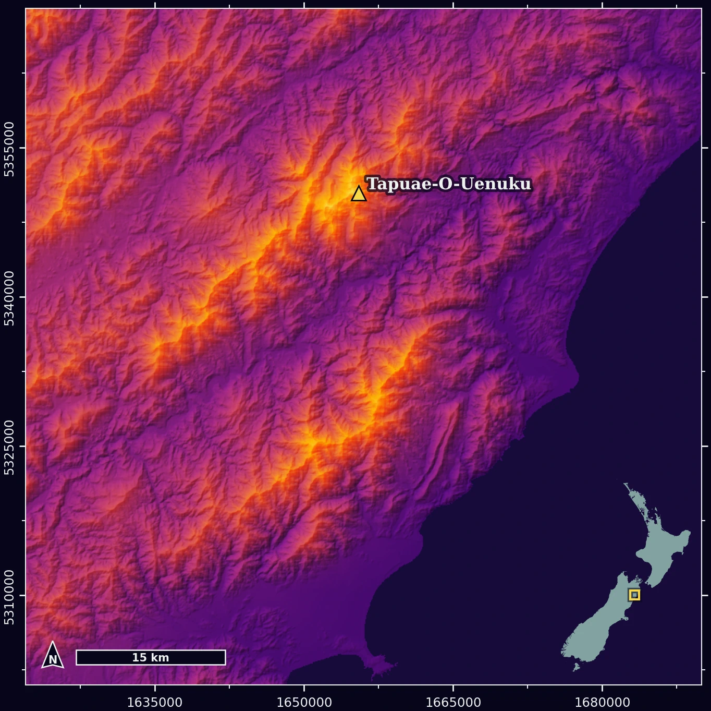

::: {#fig-maunga .fig-capped}
{fig-alt="Hillshaded relief map of the Tapuae-o-Uenuku range in warm inferno tones on a dark background"}

Tapuae-o-Uenuku – elevation coloured with inferno, hillshaded, from Copernicus DEM tiles fetched at runtime. One of five pages in the assembled PDF.
:::

A pepeha is a Māori form of self-introduction, used across New Zealand in formal settings. It locates you by the places and people you belong to – a mountain, a river, an iwi, often chosen for significance rather than birthplace – before your name arrives, last. GISC401's first assignment asks students to map theirs: three maps, generated procedurally in Python, presented together in a single PDF.

> *Kia ora tātou*  
> *Ko Tapuae-o-Uenuku te maunga*  
> *Ko Wairau te awa*  
> *Ko Rongowhakaata te iwi*  
> *Nō Te Waipounamu ahau*  
> *He akonga ahau ki te Whare Wānanga o Waitaha*  
> *Ko Zak tōku ingoa*  
> *Tēnā tātou katoa*

The usual submission is a Jupyter notebook, the data files it reads, and a PDF assembled by hand. This one was a zipped codebase. The marker pastes a LINZ API key into a notebook, runs one cell, and the pipeline does the rest – fetches every layer from live web services, renders each map, and builds the five-page PDF. No data ships with it. Nothing is added by hand.

The assignment didn't ask for any of that, which is the point. The question I set myself was what end-to-end geospatial data science looks like in Python – not downloading a shapefile and making a plot, but fetching, processing, rendering, and producing everything from source, in a codebase structured so each piece can be found, tested, and defended. The overengineering was deliberate. It was the personal challenge, and it turned a cartography assignment into a proper software build.


## The build

Each element of the pepeha gets its own treatment. The maunga is hillshaded from Copernicus GLO-90 DEM tiles, pulled as cloud-optimised GeoTIFFs from AWS. The Wairau comes from LINZ Data Service WFS layers, river lines and polygons together. The Rongowhakaata rohe is a polygon from a Gisborne District Council feature server. Natural Earth supplies the coastlines and graticules for the orthographic globes that open and close the document. Four services, none of them bundled – every run starts from the sources.

The code is laid out the way a small production system would be: `src/data/` owns the fetching, `src/processing/` the terrain and vector work, `src/maps/` one module per map plus a shared styles file, and an orchestrator module that runs the whole sequence – fetch, render, assemble – logging progress back to the notebook at each step. The notebook itself is two cells: paste a key, run. A four-level cache – DEM tiles, vector data, rendered PNGs, final PDF – means the first run takes minutes and every run after takes seconds. The layout instinct comes from a decade of working around production codebases without writing them; putting it into practice myself started with a web development course a couple of years ago, and this was the first geospatial project to get the full treatment.

A pepeha flows like water, from the maunga down to the sea, and the visual design follows it. Every element takes its colour from a single colormap, matplotlib's inferno, sampled at intervals – the maunga at the warm end, stepping down through the awa and the rohe toward the sea, with the descent visible in the elevation ramp of the maunga map itself. Neutral tones for landmass and labels were chosen to sit alongside the samples without competing. All of it lives in one styles module. No hex string appears anywhere else.

The full codebase is on [GitHub](https://github.com/zak-hynd/pepeha-mapped).


## The result

The five pages assemble into one document – globe, maunga, awa, iwi, globe again – the pepeha distributed across them, one line to a page, the closing globe gathering the remainder. It reads top to bottom the way the pepeha does, maunga to sea.

```{=html}
<object data="assets/pepeha/GISC401-MapYourPepeha-2026-Z.Hynd.pdf" type="application/pdf" style="width:100%; height:min(800px, 80vh);">
  <p>The PDF can't be displayed inline in this browser – <a href="assets/pepeha/GISC401-MapYourPepeha-2026-Z.Hynd.pdf">download it here</a>.</p>
</object>
```


## Working with AI

The project doubled as a first proper run of an AI-assisted build process – planning sessions for the architecture and design decisions, an agentic coding tool for the larger multi-file edits, and a session log and decision ledger so context survived between chats. The judgement calls, the testing, and the bug-catching stayed with me; the process is [documented in its own right](ai-workflow.qmd), because managing it well turned out to be the more interesting problem.


## Reflection

The architecture carries the marks of how it grew. The project started as several notebooks – one per map, others testing fetches against different data types – with most of the components already working before any of it was restructured. The refactor componentised that into modules, and the details got polished from there, but some seams from the notebook era survived the whole way through. Two are still visible. The LINZ key is read from an environment variable inside `linz.py`, a leftover from an earlier design, so the orchestrator has to set the variable before its imports run – an ordering constraint that a key-as-parameter refactor would remove. And each map module composes its own data fetches, which works, but means the orchestrator can only report progress per map rather than per fetch.

Both were known, and both were left on purpose. The debt got triaged like anything else: the cheap items were paid down near the end, and these two didn't make the cut – not because time ran out, but because the fix didn't justify the effort on an assignment that was already well past its brief. Tech debt isn't a failure state; it's a queue, and knowing what belongs at the bottom of it is most of the job.