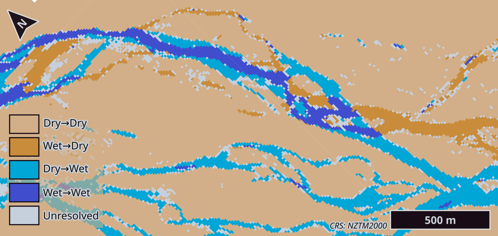

::: {#fig-change-map .figure}
{fig-alt="A close-up change map of a braided river reach. Light blue marks newly wet ground and threads across the braidplain in fresh channels; darker blue marks channels that stayed wet. Tan dry ground dominates the margins, with a small amount of orange where water was lost. The blue tones clearly outweigh the orange, and the new channels cut across ground that was previously dry." width="100%"}

The May 2021 flood at Focus Area West, southwest of the Gorge Bridge. New braids cut across previously dry ground; far less area lost water than gained it.
:::

A big flood doesn’t just raise water levels – it redraws the river. The question that matters afterwards is how the channels have shifted across the braidplain. Where the braids settle at low flow determines where new gravel sits, what critical infrastructure is at risk, and which farmland has been lost behind a breached stopbank. Environment Canterbury (ECan) answers this with aerial LiDAR at sub-metre accuracy, and nothing at Sentinel resolution competes with that. But LiDAR flights are expensive, scheduled, and months apart, and floods don’t wait for aircraft.

This project asked whether open-access satellite imagery could fill the gap between flights – a frequent, wide-area triage layer that flags where channel change has happened and points limited survey effort at the river sections that warrant it. Not a LiDAR replacement; a way of deciding where to send it. This GISC406 Remote Sensing project is framed as a proof of concept aimed at that kind of workflow.

The test case was the May 2021 Canterbury flood, which pushed the Waimakariri to roughly 2000 cumecs – an order of magnitude above its baseline flow – and reworked the braidplain along the length of the lower river.

## Why two sensors

The obvious tool for flood mapping is optical imagery – Sentinel-2's near-infrared and green bands give a clean water index (NDWI) – but the weather that causes a flood also hides it: cloud. Radar penetrates cloud, which is why Sentinel-1 SAR is the standard flood-mapping workhorse. On a braided river it hits a different wall: water and the surrounding gravel and scrub return backscatter distributions that overlap almost completely. In this corridor the two classes separated by 2.2 dB on the better polarisation – not enough to make a confident classification, but enough to corroborate one.

So neither sensor can do the job alone, and you can’t *just* blend the two different sensors’ values. The approach here combines their decisions. Every scene from either sensor is classified independently into Wet, Dry, or Uncertain, and the per-pixel labels are tallied across all passes in a time window – optical votes decide the state, agreeing SAR passes upgrade it from Provisional to Corroborated. Cloud-affected pixels stay Uncertain and simply drop out of the tally, rather than contaminating a composite. Each sensor contributes where it is strong and abstains where it is weak.

Two of these state maps – a pre-flood baseline and a post-flood window – then compare endpoint by endpoint to produce the change map: where the corridor wetted, dried, or held.

::: {#fig-state-panel .figure}
{fig-alt="A grid of maps of the same river reach, pre-flood on the left and post-flood on the right. Top row: grainy Sentinel-1 radar backscatter. Second row: true-colour satellite imagery. Third row: NDWI water index. Bottom row: the aggregated state map, running from tan dry through grey uncertain to blue wet. Left to right, the wet channel network is visibly broader and better connected after the flood, and the post-flood state map carries fewer grey uncertain pixels along the channel edges. A locator map at the base places the reach within the wider river corridor." width="100%"}

From signal to state, Focus Area East. Each column aggregates every usable pass in its window: Sentinel-1 VH backscatter (A, E), Sentinel-2 true colour (B, F) and NDWI (C, G), and the resulting per-pixel state map (D, H). Pre-flood left, post-flood right.
:::

The scope was set deliberately: per-pixel channel state, not channel geometry – 10 m pixels can't resolve braid threads narrower than themselves, and pretending otherwise is how remote sensing projects overreach. Combining optical and SAR decisions this way for braided-channel monitoring appears not to have been done before – each component is standard, the integration is the new part. Thresholds, calibration, and aggregation rules are in the [full report](assets/river-braids/gisc406-report.pdf).

## What the flood did

The pipeline classified both windows – a pre-flood baseline and the post-flood recession – with one calibration, across an order-of-magnitude difference in river flow. Nothing was retuned for the event. For a system meant to ingest every pass continuously, that is the property that matters most: there is no analyst standing by to recalibrate when conditions change, so the same thresholds have to hold at 50 cumecs and at 2000.

The change map shows the flood's signature across the corridor. About 3.3 times as much area gained water as lost it – inundation on top of migration, not migration alone. But the balance shifts along the river: in the wide braidplain, new braids cut through previously dry ground and old ones were abandoned, clear lateral migration; in the narrower sections, the existing channels mostly widened and stayed put. That distinction – braids that moved versus braids that grew – is exactly what a triage layer needs to surface, because the two patterns put different things at risk.

::: {#fig-corridor-change .figure}
{fig-alt="Change map of the lower Waimakariri corridor with two detail insets. In the wider braidplain (Focus Area West) light-blue new channels have migrated laterally, tracing fresh paths while abandoned ones show as orange. In the narrower reach (Focus Area East) the change hugs the existing channel, which has widened in place rather than moved. Tan dry ground fills the margins throughout, and across the whole corridor blue gained-water tones clearly outnumber orange lost-water areas." width="100%"}

The corridor and both focus areas. Wide braidplain (West, top): braids migrate laterally, new channels appearing as others are abandoned. Narrower reach (East, bottom): the channel widens in place rather than moving. The pattern the triage layer needs to tell apart.
:::

One result ran against expectation. Post-event imagery is usually worse – cloud, turbidity, sensor gaps – but the post-flood state map came out sharper than the baseline, with the Unresolved share nearly halving. Sustained high flow pushed marginal pixels – shallow braid edges that sat in NDWI's uncertain band at low flow – into a clean Wet signal. If that pattern holds across events, the windows where the map matters most are also the windows where it performs best.

## What's next

One river, one event is a thin test. The pipeline was built to make that a cheap problem to fix: it is parameterised on catchment name and area of interest, so extending to the Rakaia or the Rangitata, or to a quieter time period, is a re-run rather than a redesign. What a wider run would test is the property the single catchment could only suggest – whether one calibration really does hold across rivers and events, or whether the Waimakariri was a lucky fit.

The method has obvious next steps, and I'm exploring them further – a confidence-weighted vote with decay so stale passes stop corroborating the current state, additional SAR polarisations, and eventually supervised classification, once an accumulating state-map archive can generate its own training labels. That last one is the interesting inversion: the proof of concept can't use machine learning for want of ground truth, but run it long enough and it produces the ground truth itself.

The method has obvious next steps, and I'm exploring them further:

- **A smarter vote.** Confidence weighting, so passes near a classification threshold count for less than clean ones, and a decay term, so a month-old detection stops corroborating the current state. The equal-weight tally was the right starting simplification, not the end point.

- **A stronger classifier.** A random forest with texture features, so the spatial pattern of a braid counts as evidence alongside the per-pixel signal – trained initially against the accumulated state maps, validated against whatever independent truth a survey flight provides.

- **More signals in the tally.** Additional SAR polarisations, more optical bands, other constellations. Spatial resolution varies not just between satellites but between sensors on the same platform – Sentinel-2's own bands range from 10 m to 60 m – and the decision-level vote is built for exactly that mismatch: each signal contributes a label, not a measurement, so sources with incompatible resolutions and physics sit in the same tally. The proof of concept fused two signals; the architecture doesn't care how many there are.